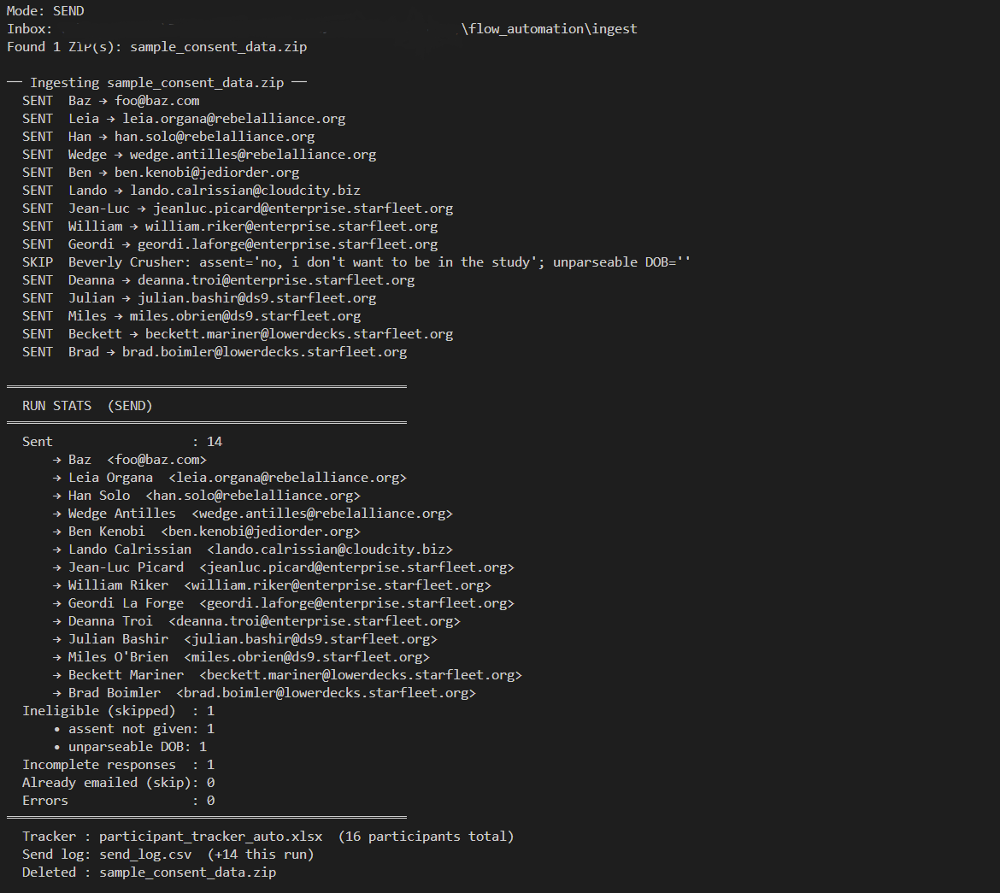

# Survey Management Pipeline

Automates the consent-to-invitation, post-survey response management, and
gift-card payment steps for the Teen AI Survey. Download a Qualtrics export,
drop it in a folder, and run one file. The scripts record every response, send
emails, track completions, and manage payment — all driven by a single shared
config file.




## How to run the whole pipeline

The three folders run in order. Each step feeds the next through the shared
master tracker (`data/participant_tracker_auto.xlsx`) and the shared `ingest/`
folder, so run them left to right.

### Step 1 — Consent → invitations (`consent_management/`)

**Start here.** Download the Qualtrics **consent/screener** export ZIP and drop
it in `ingest/`, then run `send_survey_emails.py`. This is the script that
*populates the tracker*: it records every consent response, decides who is
eligible (consent + assent + valid email + age 13–18), emails each eligible
teen a unique survey link (`?cid=<consent Response ID>`), and stamps
`emailed_at`. Nothing downstream works until this has built the tracker.

It also **screens each consent export for bot/fraud-farm/duplicate entries**
(`flag_suspicious_entries.py`). Flagged responses are recorded `SUSPICIOUS`,
are **not** emailed, and are written to a shared fraud blacklist
(`data/fraud_blacklist.csv`) that payment processing reads later. See "Fraud
screening" below.

Before screening, the mailer **auto-corrects common email typos** (mostly gmail
slips like `gmil.com` → `gmail.com`) so a real family that mistyped its address
still gets the invite instead of being bounced or flagged. It also raises a soft
`throwaway_email` signal when the delivery domain is a known disposable domain
(`data/email_throwaway_domains.txt`), unless the domain is whitelisted
(`data/email_domain_whitelist.txt`).

### Step 2 — Completions + reminders / re-invites (`response_management/`)

Once teens start taking the survey, download the Qualtrics **teen response
survey** export ZIP and drop it in `ingest/`, then run `manage_responses.py`.
**This step requires a Qualtrics response ZIP** — it reads the `cid` column to
match completions back to the tracker (stamping `survey_completed_at`) and to
decide who still needs a reminder / re-invite. Run it repeatedly as responses
come in; it only ever sends each follow-up once.

### Step 3 — Payment (`payment_management/`)

Run `manage_payments.py` to manage gift cards. **This step also needs the
Qualtrics response data**: it reads the same response-survey export from
`ingest/` to compute data-quality flags, combines that with the tracker's
consent + completion record (merged on `cid`), upserts the payment ledger
(`data/payment_tracker.xlsx`), and writes the unpaid report
(`data/payment_report_unpaid.xlsx`). You then buy and send the Amazon cards by
hand and mark people paid in the ledger.

```
   consent ZIP                response ZIP                 response ZIP
       │                          │                            │
       ▼                          ▼                            ▼
 consent_management   →    response_management    →     payment_management
 builds tracker,          stamps completions,          quality flags + ledger
 sends invites           sends reminders/re-invites     + unpaid card report
       └──────────────► data/participant_tracker_auto.xlsx ◄──────────────┘
```

> **Ingest is now an append-only archive.** ZIPs are no longer deleted after a
> run. Each script reads only the **most recently modified** ZIP in `ingest/`
> and leaves the rest in place. Re-reading an already-processed export is safe:
> invitations dedup on the tracker, completion stamping keeps the first
> completion, and the payment ledger preserves your manual edits.


## Repository structure

```
survey_management/
├── config.yaml                  Shared configuration. Copy from config.sample.yaml
│                                and fill in your values before running anything.
├── config.sample.yaml           Template config with all keys documented.
├── requirements.txt             Python package list (pandas, openpyxl, pywin32, pyyaml).
├── setup.bat                    One-time setup: creates .venv for all scripts.
├── LICENSE
│
├── ingest/                      Where you drop Qualtrics export ZIPs (append-only;
│                                the newest ZIP is read each run, none are deleted).
│                                Consent ZIPs feed consent_management/; response ZIPs
│                                feed response_management/ and payment_management/.
│
├── data/                        Bookkeeping folder (auto-created on first run).
│                                Files here are written by the scripts. The only
│                                file you edit by hand is payment_tracker.xlsx
│                                (the `paid` columns).
│   ├── participant_tracker_auto.xlsx   Master tracker: one row per consent response,
│   │                                  updated by consent + response scripts.
│   ├── send_log.csv                   Append-only log of every email sent or drafted.
│   ├── reminder_log.csv               Append-only audit log of reminder emails.
│   ├── payment_tracker.xlsx           Payment ledger: completions + quality flags +
│   │                                  your hand-edited paid/paid_date columns.
│   ├── payment_report_unpaid.xlsx     Unpaid report, split into Pay, Hold, and Fraud sheets.
│   ├── fraud_blacklist.csv            Blacklisted consent Response IDs + IPs (bots/scammers),
│   │                                  written by the consent fraud screen, read by payment.
│   ├── email_throwaway_domains.txt    Known throwaway/disposable email domains (public list +
│   │                                  curated extras). Read by the consent screen and payment.
│   └── email_domain_whitelist.txt     Institution domains never treated as throwaway
│                                      (.edu, schools, plus exact entries like lsoc.org).
│
├── consent_management/          Processes consent exports and sends survey invitations.
│   ├── send_survey_emails.py    Invitation pipeline script (run FIRST).
│   ├── flag_suspicious_entries.py  Bot/fraud/duplicate screen; writes fraud_blacklist.csv.
│   ├── test_flag_suspicious_entries.py  Unit tests for the fraud screen.
│   ├── run.bat                  Real send mode.
│   └── run_draft.bat            Draft/review mode.
│
├── response_management/         Matches completions and sends reminders / re-invites.
│   ├── manage_responses.py      Response pipeline script (run SECOND).
│   ├── run_responses.bat        Real send mode for reminders.
│   ├── run_responses_draft.bat  Draft/review mode for reminders.
│   ├── run_responses_dryrun.bat Dry-run mode (no emails, tracker updated only).
│   ├── quality_filter.py        Vendored copy of the shared quality filter.
│   └── quality_config.json      Vendored copy of the shared thresholds.
│
├── payment_management/          Gift-card payment: ledger + unpaid report.
│   ├── manage_payments.py       Payment pipeline script (run THIRD).
│   ├── test_fraud_payments.py   Unit tests for the Fraud bucket.
│   ├── run_payments.bat         Build/refresh the ledger + report.
│   ├── run_payments_dryrun.bat  Dry-run mode (print only, write nothing).
│   ├── quality_filter.py        Vendored copy of the shared quality filter.
│   ├── quality_config.json      Vendored copy of the shared thresholds.
│   └── README.md                Payment workflow details.
│
├── examine_indv/               Look up ONE participant and read their answers.
│   ├── examine_app.py          Local web app: search by name/RID/email, see
│   │                           status (PAY/HOLD/FRAUD/PAID) + reason + answers,
│   │                           and a "Mark as fraud" button.
│   ├── examine_data.py         Read-only data layer.
│   ├── examine_write.py        The only writer: "Mark as fraud" updates the
│   │                           blacklist, payment_tracker, and unpaid report.
│   ├── launch.sh / launch.bat  Launchers.
│   └── README.md               How it works and how to run it.
│
└── docs/
    └── send_survey_sample.png
```


## One-time setup

1. **Use classic Outlook for Windows.** The email scripts drive the Outlook
   desktop app directly. They do **not** work with New Outlook, Outlook on the
   web, or Mac. If the New Outlook toggle is on in the top-right corner, turn it
   off. (Payment management does not touch Outlook.)

2. **Install Python 3** (3.10 or later). During install, tick "Add Python to PATH".

3. **Double-click `setup.bat`** in the `survey_management/` folder. This creates
   `.venv/` and installs all packages. Run it once — all scripts share the venv.

4. **Copy `config.sample.yaml` to `config.yaml`** and fill in every value.
   See the config reference below.


## Setting up config.yaml

`config.yaml` is the single source of truth for all scripts. Every path,
interval, and Qualtrics field name comes from here. The scripts load it from
`survey_management/config.yaml` at startup.

### Full config-key reference

| Config key | Used by | What it controls |
|---|---|---|
| `survey_link` | consent + response | Base Qualtrics URL for the teen survey. The invitation script appends `?cid=<rid>` per participant; the response script uses it for reminder links. |
| `sender.name` | consent + response | Name shown in email signatures. |
| `sender.title` | consent + response | Title line in email signatures. |
| `sender.contact_email` | consent + response | Contact address shown in emails. |
| `shared_mailbox` | consent + response | Shared mailbox address for `SentOnBehalfOfName`. Leave `""` to send from your own account. |
| `age_limits.min` | consent | Minimum eligible age (default 13). |
| `age_limits.max` | consent | Maximum eligible age (default 18). |
| `paths.inbox_dir` | all three | Folder where Qualtrics ZIPs are dropped, relative to `survey_management/`. Default: `ingest`. |
| `paths.tracker_file` | all three | Master XLSX tracker path, relative to `survey_management/`. Default: `data/participant_tracker_auto.xlsx`. |
| `paths.send_log_file` | consent + response | Append-only CSV of sent/drafted emails. Default: `data/send_log.csv`. |
| `paths.reminder_log_file` | response | Append-only CSV of sent/drafted reminders. Default: `data/reminder_log.csv`. |
| `qualtrics_fields.*` | consent | Column header labels in the **consent** survey export. Each sub-key maps to an exact (or substring-matched) column header. |
| `response_qualtrics_fields.response_id` | response | "Response ID" column in the response survey export. |
| `response_qualtrics_fields.recorded_date` | response | "Recorded Date" column in the response survey export. |
| `response_qualtrics_fields.finished` | response | "Finished" column in the response survey export. |
| `response_qualtrics_fields.cid` | response + payment | Embedded-data column capturing the `?cid=` URL parameter (default: `cid`). Must match the field name in the Qualtrics survey flow. |
| `consent_ok` | consent | Lowercase strings accepted as valid parent consent. |
| `assent_ok` | consent | Lowercase strings accepted as valid child assent. |
| `response_cutoff_date` | response + payment | ISO date. Entries recorded before this date are ignored. |
| `reminder_intervals.follow_up_1_days` | response | Days after invitation before follow-up 1 is sent (default: 3). |
| `reminder_intervals.follow_up_2_days` | response | Days after follow-up 1 was sent before follow-up 2 is sent (default: 2). Each follow-up is spaced off the previous one, not off the original invite date. |
| `tracker_columns` | consent + response | Ordered column list for the Participants sheet. Response columns (`survey_completed_at`, `follow_up_1_sent_at`, `follow_up_2_sent_at`) are at the end and preserved by both scripts. |


## Invitation pipeline (consent_management/)

### Typical workflow

1. Download the consent/screener Qualtrics export ZIP.
2. Drop it into `ingest/`.
3. Double-click **`run_draft.bat`** the first few times — stages each invitation
   in Outlook Drafts for review before anything goes out.
4. Once output looks correct, use **`run.bat`** for hands-off sending.

You can also run from a terminal in `consent_management/`:

```
..\.venv\Scripts\python send_survey_emails.py               REM send
..\.venv\Scripts\python send_survey_emails.py --draft       REM stage drafts
..\.venv\Scripts\python send_survey_emails.py --dry-run     REM parse only
..\.venv\Scripts\python send_survey_emails.py --record-only REM recovery: see below
```

The script reads only the **most recent** ZIP in `ingest/` and never deletes it.

### Before every send: close Excel

The script writes `data/send_log.csv` and the tracker at the end of a run. If
either file is **open in Excel**, Windows locks it. The script now **checks both
files are writable in preflight and aborts before sending a single email** if one
is locked — so close those workbooks first. (Previously a lock could let emails go
out and then fail to record them.) If a write still fails for any reason, the
records are saved to a timestamped `*.RECOVERY-*.csv` / `.xlsx` file instead of
being lost, with on-screen instructions.

### Recovery mode (`--record-only`)

If emails went out but the bookkeeping did not get written (e.g. an old run that
crashed on a locked `send_log.csv`), close Excel and run:

```
..\.venv\Scripts\python send_survey_emails.py --record-only
```

This contacts **no** Outlook. It recomputes who was eligible from the same consent
ZIP, marks them `SENT`, and rebuilds `send_log.csv` + the tracker so dedup is
restored and nobody gets emailed twice on the next real run. Use it only when you
know the emails already went out (the crash happened after sending).

### What each mode does

| Mode | Emails | ZIPs in ingest | Use it for |
|---|---|---|---|
| `run.bat` | Sent immediately | Kept (newest read each run) | Routine batches once trusted |
| `run_draft.bat` | Saved to Drafts | Kept | First batch or review |
| `--dry-run` | None | Kept | Sanity-checking a new export |

### Who gets an invitation

A consent response is emailed only if all of these hold:

- Qualtrics `Finished` is `True`
- Parent consent = "I Consent" and parent signature is non-blank
- Child assent = "Yes, I want to be in the study" and child signature is non-blank
- A valid delivery email is present
- Calculated age (from date of birth) is 13–18

Everything else is logged as `INELIGIBLE` or `INCOMPLETE` in the tracker.

### No double-sends

`emailed_at` is stamped once and never overwritten. Every re-run skips anyone
already in the send log, so re-reading the same ZIP cannot re-email anyone. A
`--draft` run counts as handled — send drafts from Outlook; don't follow with
`run.bat`.

### Outputs

`data/participant_tracker_auto.xlsx` has two sheets:

- **Participants** — one row per consent Response ID, with status, reason, age,
  `first_seen`, `last_updated`, `emailed_at`, and the three response columns
  preserved across every re-run.
- **Run Stats** — counts from the most recent invitation run.

`data/send_log.csv` — append-only, one row per email sent or drafted.


## Response management pipeline (response_management/)

### Typical workflow

1. Download the teen response survey Qualtrics export ZIP and drop it in
   `ingest/`.
2. From `response_management/`, double-click a runner or run:

```
..\.venv\Scripts\python manage_responses.py --dry-run   REM check first
..\.venv\Scripts\python manage_responses.py --draft     REM stage reminders
..\.venv\Scripts\python manage_responses.py             REM send reminders
```

The script reads only the **most recent** ZIP in `ingest/` and never deletes it.

### What it does

**Completion matching.** The script reads the `cid` embedded-data column from
the response export. The `cid` value equals the participant's consent
`Response ID` — the same ID the invitation script encoded into the survey link
as `?cid=<rid>`. The script looks that up in the tracker and stamps
`survey_completed_at`.

**Date cutoff.** Rows recorded before `response_cutoff_date` (default
`2026-06-09`) are silently skipped.

**Missing-cid flagging.** A response row with no `cid` value is flagged in
the console without crashing the script.

**Reminder emails / re-invites.** Invited participants who haven't completed yet
(spacing-based model):

| Condition | Action |
|---|---|
| Days since invite >= `follow_up_1_days` (3) and `follow_up_1_sent_at` blank | Send follow-up 1 |
| Days since follow-up 1 sent >= `follow_up_2_days` (2) and `follow_up_2_sent_at` blank | Send follow-up 2 |

Follow-up 2 is anchored to when follow-up 1 was actually sent, not to the original invite date. This means the gap between reminders stays consistent regardless of when you first run the script. Each follow-up is sent once; the timestamp is written to the tracker on send.

> Gift-card / payment handling no longer lives here. The old completion gift-card
> printout moved to `payment_management/` (run it third). This script now only
> tracks completions and sends reminders.

### Wrong-ZIP protection

Before processing any file, the script inspects the CSV headers. If it finds
consent-specific columns ("Parent/Guardian Full Name", "I confirm that I have
read…", etc.) it prints a clear warning and exits without touching any data.

### What each mode does

| Mode | Emails | Tracker |
|---|---|---|
| `run_responses.bat` | Sent immediately | Completions + follow-up timestamps updated |
| `run_responses_draft.bat` | Saved to Drafts | Same |
| `run_responses_dryrun.bat` | None | Completions updated; follow-up timestamps NOT written |

### Outputs

`data/participant_tracker_auto.xlsx` — same file used by the invitation script.
Response script updates only `survey_completed_at`, `follow_up_1_sent_at`, and
`follow_up_2_sent_at`.

`data/send_log.csv` — appends reminder records with status `SENT_1`, `SENT_2`,
`DRAFTED_1`, or `DRAFTED_2`.

`data/reminder_log.csv` — separate reminder audit log with `reminder_type` and
`days_since_anchor` columns (`anchor` = invite date for follow-up 1; follow-up 1 sent date for follow-up 2).


## Payment management pipeline (payment_management/)

Run this **third**, after completions exist in the tracker. It decides and
tracks who gets a $10 Amazon gift card. Full details in
`payment_management/README.md`.

### Typical workflow

1. Make sure `manage_responses.py` has stamped completions, and the response
   survey export is still in `ingest/` (so quality flags can be computed).
2. From `payment_management/`, run:

```
..\.venv\Scripts\python manage_payments.py --dry-run   REM print only
..\.venv\Scripts\python manage_payments.py             REM write ledger + report
```

### What it does

- **Confirms consent + completion** by reading the tracker: a payable
  participant is a row with `survey_completed_at` set (which already required a
  `cid` match against a consenting participant).
- **Computes quality flags** by running the vendored `quality_filter.py` on the
  newest response export in `ingest/`, keyed by `cid`.
- **Upserts `data/payment_tracker.xlsx`** — one row per completion, with the
  quality flags and a hand-editable `paid` column. Re-runs preserve your
  `paid` / `paid_date` / `paid_amount` / `notes` edits (merged by `cid`).
- **Writes `data/payment_report_unpaid.xlsx`** — everyone not yet marked paid,
  with first name + delivery email, split into **Pay**, **Hold**, and **Fraud**
  sheets (see policy notes below).
- **Refuses to pay blacklisted entries.** It reads `data/fraud_blacklist.csv`
  and routes any completer whose `cid` or survey IP is on the list to a **Fraud**
  sheet that is never paid (separate from Hold). See "Fraud screening" below.

### Pay vs Hold (read this)

`QUALITY_CONTROL.md` sets the default protocol: **pay every teen who completes**,
treat exclusion as an analysis-only decision. Splitting flagged completers into
a Hold bucket conditions payment on quality flags, which deviates from that
protocol and should only be done with IRB sign-off. The behaviour is controlled
by two switches at the top of `manage_payments.py`:

- `HOLD_BUCKET_ENABLED` — `True` routes `exclude_recommended` completers to the
  Hold sheet. Set `False` to pay everyone and treat flags as review-only.
- `HOLD_ON_ANY_FLAG` — `True` (current setting, June 2026) holds on any single
  flag (`n_flags >= 1`); `False` holds only on the filter's >= 2-flag combination
  rule. Payment-side only; the analysis `exclude_min_flags` stays at 2.


## Examine an individual (`examine_indv/`)

A read-only lookup tool for when you want to understand *one* participant rather
than run a batch. Start it with `python examine_indv/examine_app.py`, then open
the local URL it prints. Search by name (first, or first + last), by response ID
(`R_…`), or by email. It finds the person in `participant_tracker_auto.xlsx`,
confirms whether they have a completed survey, tells you their payment status
(PAY / HOLD / FRAUD / PAID) and the reason, and shows their survey answers plus
key quality metadata.

It reads the same files the pipeline writes (`participant_tracker_auto.xlsx`,
`payment_tracker.xlsx`, `fraud_blacklist.csv`, and the newest survey ZIP in
`ingest/`). Status precedence and the fraud-blacklist cross-check mirror the
payment pipeline.

It is read-only except for one explicit action: a **Mark as fraud** button on
the detail view. After a confirmation popup it appends to `fraud_blacklist.csv`
(the source the payment pipeline reads), sets `fraud=yes` in
`payment_tracker.xlsx`, and moves the person into the Fraud sheet of
`payment_report_unpaid.xlsx`, so the change is durable and the dashboard reflects
it. Writes are atomic and idempotent; close those workbooks in Excel first. See
`examine_indv/README.md` for details.


## Fraud screening (consent + payment)

Fraud is a different problem from data quality, handled in a different place.
Where the quality filter judges a *real* teen's answers, the fraud screen judges
whether a consent submission is a **bot, fraud farm, or duplicate** in the first
place — before anyone is invited or paid.

**At consent time** (`consent_management/`), `send_survey_emails.py` runs
`flag_suspicious_entries.py` over each consent export and flags entries on
signals specific to the consent form:

- many finished submissions from one IP (a farm),
- the same email + same child submitted more than once,
- low Qualtrics reCAPTCHA score (below 0.7),
- completion speed, in two tiers: under 30s is implausibly fast and flags on its
  own; under 76s is suspiciously fast and only counts with a second signal,
- a delivery email on a known throwaway/disposable domain
  (`data/email_throwaway_domains.txt`), unless whitelisted,
- one person typing both the parent and child signature,
- a name-token swap — the child's surname is the parent's *given* name, the
  hallmark of a fraud farm shuffling a small pool of tokens.

Email typos are corrected before this check, so a slip like `gmil.com` is fixed
to `gmail.com` and never counts as throwaway. Institution domains in
`data/email_domain_whitelist.txt` (`.edu`, schools, and exact entries like
`lsoc.org`) are never treated as throwaway, so real school addresses are safe.

The signals are split into **technical** ones (IP, reCAPTCHA, speed, throwaway
email) and
**contextual** ones (the signature and name checks). An entry is flagged only on
a hard signal, two technical signals, or one technical signal plus a contextual
one. The contextual checks **never fire alone**, because they have legitimate
explanations — a parent may sign for a young child, and "child surname = parent
given name" is normal patronymic naming (e.g. South India). There is **no**
judgement of whether a name "looks real," so non-Western names are not penalised;
the name check is purely structural (position of a shared token) and only ever
escalates an entry that already has a technical signal.

It also does **not** flag a parent submitting for different children (siblings),
a signature that differs from the typed name only by a middle initial or spacing,
or a normal shared surname. Flagged entries are marked `SUSPICIOUS`, are not
emailed, and are appended to **`data/fraud_blacklist.csv`** (response ID + IP +
reason).

**At payment time** (`payment_management/`), `manage_payments.py` reads that
blacklist and routes any completer whose `cid` **or** survey IP is on it to a
**Fraud (do not pay)** sheet — never paid, and separate from the Hold bucket.
It also checks the delivery email against the throwaway-domain list and routes a
match to the **Hold** sheet for review (never auto-paid), so a gift card never
goes to a disposable address without a human deciding first.
This is the backstop for a scammer who somehow obtains a survey link and
completes it. The blacklist is plain CSV and hand-editable (`source = manual`
to add a row, delete a row to clear a false positive); re-runs preserve manual
edits. Details: `payment_management/README.md`.

Run the screen standalone to preview, or to (re)build the blacklist:

```bash
cd consent_management
python flag_suspicious_entries.py            REM newest consent ZIP in ingest/
python flag_suspicious_entries.py --no-blacklist   REM review only, don't write the list
```

Tests: `consent_management/test_flag_suspicious_entries.py` and
`payment_management/test_fraud_payments.py` (run with `python -m unittest`).


## Data quality (shared filter)

`quality_filter.py` and `quality_config.json` are **vendored copies** of the
shared exclusion filter (canonical source in the project root, synced into all
consumers by `sync_qc.bat`). Copies live in `response_management/`,
`payment_management/`, and the `Teen AI Survey Analysis` repo. **Never edit the
copies** — edit the project-root files and re-run `sync_qc.bat`. Full rule:
`QUALITY_CONTROL.md`.

Run it standalone against an export CSV to eyeball quality:

```bash
cd payment_management
python quality_filter.py path\to\teen_survey_export.csv -o quality_report.csv
```


## Shared mailbox

`shared_mailbox` in `config.yaml` routes the From via Outlook's
`SentOnBehalfOfName`. You need **Send As** permission for recipients to see the
mail as coming straight from the shared address. If the From line on a draft
still shows your personal account, add the shared mailbox under
File → Account Settings in Outlook.


## Troubleshooting

- **Dispatch error or nothing happens** — you're on New Outlook or it isn't
  running. Switch to classic Outlook and open it first.
- **Mail bounces back from Exchange** — Send As permission isn't active yet.
- **A security popup per email** — out-of-date antivirus; a current AV registered
  with Windows Security Center suppresses it.
- **`PermissionError` / "Permission denied" on `send_log.csv` or the tracker** —
  the file is open in Excel. The script now catches this in preflight and aborts
  before sending; close the workbook and re-run. If you hit this on an *older*
  build that already sent the emails, close Excel and run `--record-only` to
  rebuild `send_log.csv` + the tracker so no one is emailed twice.
- **"No .zip files found"** — the export isn't in `ingest/`, or isn't a `.zip`.
- **Script used an old export** — each script reads the *most recently modified*
  ZIP in `ingest/`. If it grabbed the wrong one, re-download or re-save the
  intended export so it becomes the newest file.
- **"Detected a Consent Survey ZIP"** — you dropped the screener export and ran
  `manage_responses.py`. Use `consent_management/` for consent ZIPs;
  `response_management/` and `payment_management/` use the teen survey ZIP.
- **cid not found / unmatched completions** — verify that `cid` is configured as
  embedded data in the Qualtrics survey flow and that `response_qualtrics_fields.cid`
  in `config.yaml` matches the export column header exactly.
- **Payment report shows "NOT EVALUATED"** — no response export was in `ingest/`,
  so quality flags could not be computed. Those completers land in the Pay sheet.
- **Wrong people flagged ineligible** — check the `reason` column in the tracker.
  If consent/assent wording changed in Qualtrics, update `consent_ok` / `assent_ok`
  in `config.yaml`.
